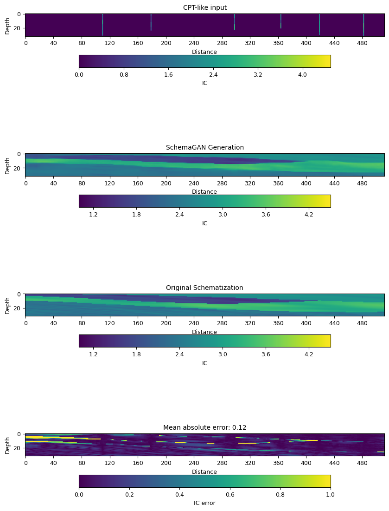

# Deep Learning for Geotechnical Engineering: The Effectiveness of Generative Adversarial Networks in Subsoil Schematization

## Description

This repository contains the code and results related to a novel Generative Adversarial Network application called SchemaGAN. SchemaGAN has been adapted from the Pix2Pix architecture to take Cone Penetration Test (CPT) data as a conditional input and generate subsoil schematizations.

For a detailed description and findings, please refer to the following publication:

**Campos Montero, F.A., Zuada Coelho, B., Smyrniou, E., Taormina, R., & Vardon, P.J. (2025)**  
*SchemaGAN: A conditional Generative Adversarial Network for geotechnical subsurface schematisation*  
Computers and Geotechnics, 183, 107177  
[https://doi.org/10.1016/j.compgeo.2025.107177](https://doi.org/10.1016/j.compgeo.2025.107177)

If you use SchemaGAN in your work, please cite this paper.

**Keywords:** Deep learning, machine learning, generative adversarial network, schematization, cone penetration test, interpolation, stratigraphy.

---

## Installation

To install schemaGAN, it is recommended to use a Python virtual environment. Follow these steps:

1. Install and activate a Python virtual environment.
2. Install schemaGAN using either the provided [environment.yml](environment.yml) or [requirements.txt](requirements.txt) file.

schemaGAN supports Python 3.10.

## Usage

1. **Download the Model:**

   Download the schemaGAN model from [Zenodo](https://zenodo.org/records/13143431/files/schemaGAN.h5). This model is freely available.

2. **Prepare the Images:**

   The subsoil schematisations used in this work were generated using [GeoSchemaGen](https://github.com/fabcamo/GeoSchemaGen). The dataset for training, validation, and testing is available on [Zenodo](https://zenodo.org/records/13143431/files/data.zip).

      Ensure that the images are in CSV file format. The images must be 2D and have dimensions (512, 32).

      | index | x | z | IC value |
      |-------|---|---|----------|
      | 0 | 0 | 0 | 2.7 |
      | 1 | 0 | 1 | 1.5 |
      | 2 | 0 | 2 | 1.7 |
      ....
      | 16383 | 511 | 31 | 2.6 |


3. **Run schemaGAN:**

   To run schemaGAN first you need to import the necessary packages:

   ```python
   import os
   import numpy as np
   import matplotlib.pyplot as plt
   from tensorflow.keras.models import load_model

   from schemaGAN.functions.utils import read_all_csv_files, apply_miss_rate_per_rf, IC_normalization
   from schemaGAN.functions.summarize import plot_images_error
   ```

   You need to define the paths for the location of the images, model and results. In this case we will be using two images from the validation dataset that are available in this [folder](example_schematisations):

   ```python
   path_validation = 'example_schematisations' # This is CSV data
   path_to_model = 'schemaGAN.h5'
   path_results = 'results' # Just were to save the data
   if os.path.exists(path_results) is False:
      os.makedirs(path_results)
    ```

   In this example we fix the seed for result reproducibility and set the size of the images and the missing rate for the simulation of the CPTs:

   ```python
   seed = np.random.randint(20220412, 20230412)
   # Set the seed for NumPy's random number generator
   np.random.seed(seed)

   # CHOOSE THE DIMENSIONS AND MISSING RATE
   SIZE_X = 512
   SIZE_Y = 32
   no_rows = SIZE_Y
   no_cols = SIZE_X
   # Choose missing rate
   miss_rate = 0.99
   min_distance = 51
   ```

   Now it is about loading the data and creating the fake CPT profiles (with normalised values):

   ```python
   # Load the data
   all_csv = read_all_csv_files(path_validation)

   # Remove data to create fake-CPTs
   missing_data, full_data= apply_miss_rate_per_rf(all_csv, miss_rate, min_distance)
   no_samples = len(all_csv)

   # Reshape the data and store it
   missing_data = np.array([np.reshape(i, (no_rows, no_cols)).astype(np.float32) for i in missing_data])
   full_data = np.array([np.reshape(i, (no_rows, no_cols)).astype(np.float32) for i in full_data])
   tar_images = np.reshape(full_data, (no_samples, no_rows, no_cols, 1))
   src_images = np.reshape(missing_data, (no_samples, no_rows, no_cols, 1))

   # Create the array of source and target images
   data = [src_images, tar_images]

   # Normalize the data from [0 - 4.5] to [-1 to 1]
   dataset = IC_normalization(data)
   [input_img, orig_img] = dataset
   ```

   Now we load the model and generate the schematisations. This is done for each image in the dataset:

   ```python
   # Load the model
   model = load_model(path_to_model)

   # Create the container for the MAE, MSE, RMSE
   mae_list = list()
   mse_list = list()
   rmse_list = list()

   for i in range(len(input_img)):
      # Choose a cross-section to run through the generator
      cross_section_number = i
      # Choose a given cross-section
      ix = np.array([cross_section_number])
      src_image, tar_image = input_img[ix], orig_img[ix]

      # Generate image from source
      gen_image = model.predict(src_image)

      # Calculate the Mean Absolute Error (MAE) between the target image and the generated one
      mae = np.mean(np.abs(tar_image - gen_image))
      mae_list.append(mae)
      # Calculate the Mean Squared Error (MSE)
      mse = np.mean(np.square(tar_image - gen_image))
      mse_list.append(mse)
      # Calculate the Root Mean Squared Error (RMSE)
      rmse = np.sqrt(mse)
      rmse_list.append(rmse)

      plot_images_error(src_image, gen_image, tar_image)
      # Save the plot as a pdf in the results folder
      plot_acc = os.path.join(path_results, f'plot_acc_{i:06d}.png')
      plt.savefig(plot_acc, bbox_inches='tight')

      plt.close()
    ```

   At the end of the script the results will be saved on the results folder.

   Example of the results:
   

3. **Run schemaGAN for the entire dataset:**

   To process the entire dataset and compare it against the different interpolations models, please refer to [load_and_generate.py](schemaGAN/load_and_generate.py).

---

## Summary
After extensive testing and evaluation, SchemaGAN was found to outperform traditional interpolation methods (Nearest Neighbour, Inverse Distance Weight, Kriging, Natural Neighbour) as well as newer methods such as Inpainting. SchemaGAN results are characterized by clearer layer boundaries and accurate anisotropy within the layers. The superior performance of SchemaGAN is further confirmed through a blind survey, where it ranked as the top-performing method in 78% of cases as per experts in the field. For a comprehensive analysis of the results and findings, please refer to the [official thesis](https://repository.tudelft.nl/record/uuid:c18cb6cf-3574-484d-aacc-dabd882341de).

---

## 📜 License

This project is licensed under the MIT License. See the [LICENSE](./LICENSE) file for details.

---

## 📚 Third-Party Licenses

SchemaGAN uses third-party Python packages under permissive open-source licenses (MIT, BSD, Apache 2.0, etc.). Notably, it depends on:

- [GSTools](https://github.com/GeoStat-Framework/GSTools) (MIT License) — via its dependency on [GeoSyn](https://github.com/fabcamo/GeoSyn), a tool used for generating training data  
- [TensorFlow](https://github.com/tensorflow/tensorflow) (Apache 2.0 License) — for training and inference

Please ensure you comply with these licenses when using or modifying SchemaGAN.

For a full list of dependencies, see [`requirements.txt`](./requirements.txt).

To review license information for installed packages, you can use:

```bash
pip install pip-licenses
pip-licenses
```
